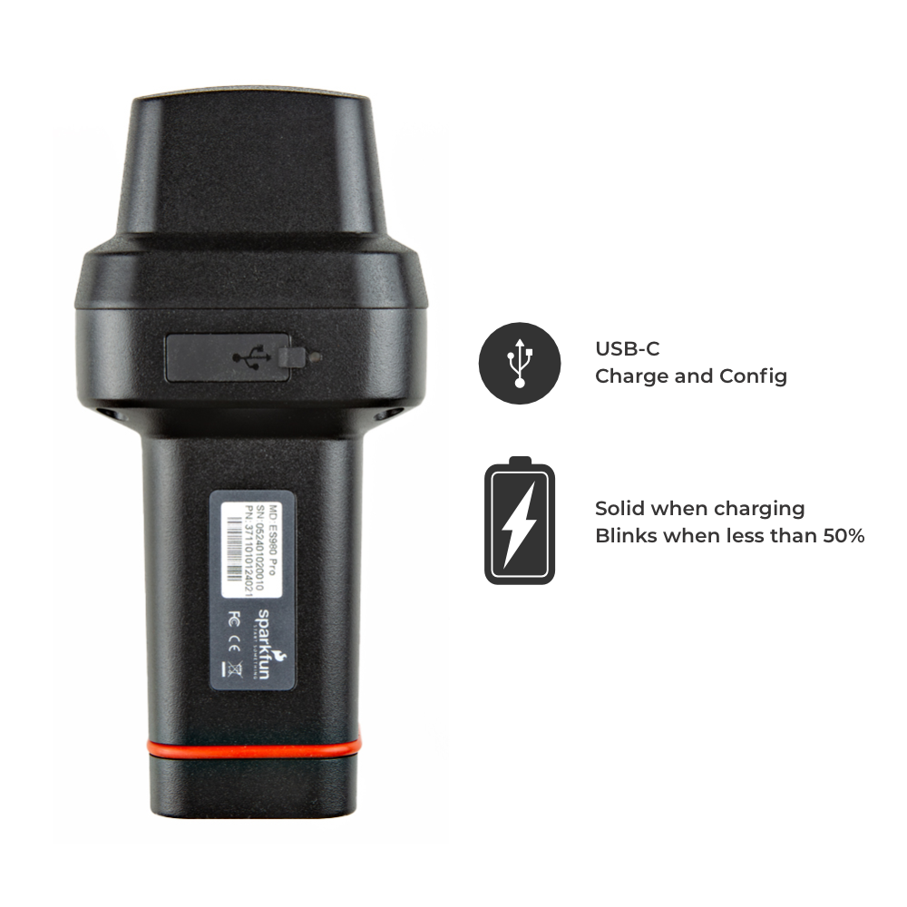
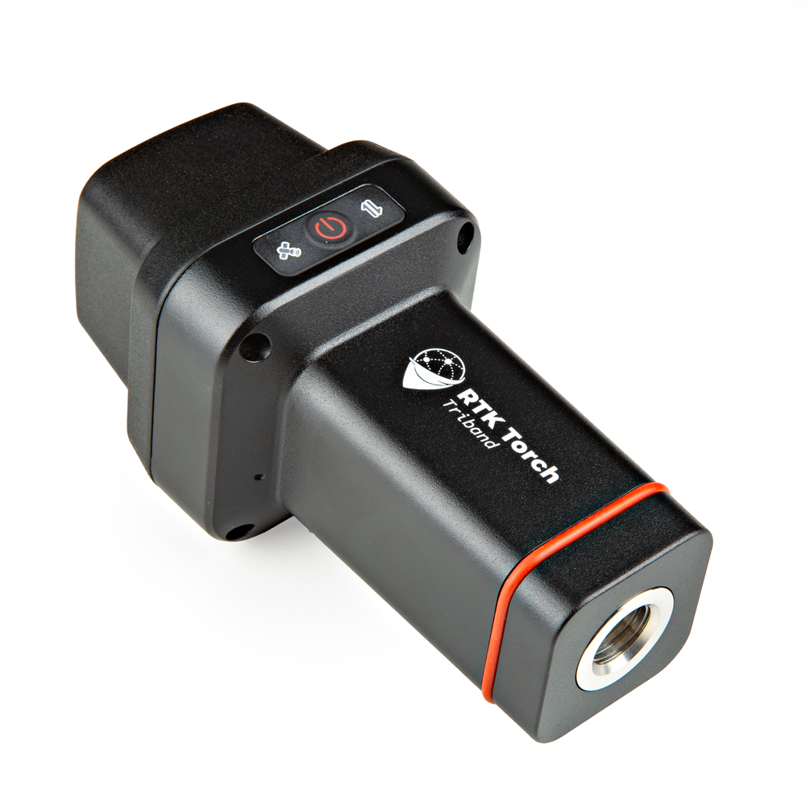
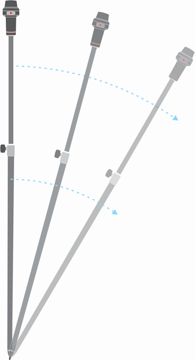

# Hardware Overview

This is an overview of the [RTK Torch hardware](https://www.sparkfun.com/products/25662) including the parts included with the kit. For an in-depth description of the software and configuration options for the RTK Torch, please refer to the [RTK Everywhere Product Manual](https://docs.sparkfun.com/SparkFun_RTK_Everywhere_Firmware/) which describes the software features of all SparkFun RTK Everywhere capable products.

## GNSS Receiver Specifications

*RTK Torch on a Monopod + Bipod*

The RTK Torch from SparkFun Electronics uses the UM980 high precision RTK capable GNSS receiver from Unicore ([datasheet](../Datasheets/UM980_Datasheet.pdf)). The receiver is capable of achieving the following accuracies:

* Single Point Positioning: 
    * Horizontal: 1.5m
    * Vertical: 2.5m
* DGPS:
    * Horizontal: 0.4m
    * Vertical: 0.8m
* RTK:
    * Horizontal: 8mm
    * Vertical: 15mm

*L1/L2/L5 helical antenna*

The UM980 is capable of receiving the following GNSS frequencies:

* GPS: L1C/A, L1C, L2P(Y), L2C, L5
* GLONASS: L1, L2
* Galileo: E1, E5a, E5b, E6
* Beidou: B1I, B2I, B3I, B1C, B2a, B2b
* QZSS: L1, L2, L5
* SBAS

The RTK Torch utilizes a specially tuned multi-frequency helical antenna making the overall device smaller and more lightweight than competing units. 

## Antenna Reference Point

*SparkFun RTK Torch Antenna Reference Point to Antenna Phase Centers*

The distance between the ARP on the RTK Torch to the L1 APC (antenna phase center) is **115mm** and **118mm** to the L2/L5 APC.

## Power / USB

The human interface to the RTK Torch is simplistic by design! There is only one button, one USB port, and three LEDs.

*RTK Torch Power Button and LEDs*

To turn the RTK Torch on, press and hold the power button for ~4 seconds. You will hear a short beep and all LEDs will illuminate indicating the device has powered on.

To turn off the RTK Torch, press and hold the power button for ~4 seconds. You will hear *three* short beeps and all LEDs will turn off indicating the device has powered down.

The GNSS icon has two LEDs: a yellow LED will blink once per second when a GNSS fix is achieved, and a green LED will illuminate solid when RTK Fix is achieved.

The Bluetooth icon will blink once per second while waiting for a connection. It will become solid when a device (phone, laptop, tablet, etc) is connected.

*USB Port cover and Power LED*

A USB-C connector is hidden beneath a rubber cover. The enclosure is IP67 waterproof if and only if this cover is fully closed. 

The power LED is located next to the USB cover. It is green when external power is connected. When the device is on, this LED will be solid red indicating more than 50% battery capacity remains. The red LED will blink once per second if less than 50% of the battery capacity remains.

## Enclosure

*Torch Enclosure*

The RTK Torch utilizes a rugged enclosure made of a cast aluminum body with a plastic cover over the tri-band helical antenna.

*L1/L2/L5 helical antenna*

The helical antenna is specially tuned to receive multiple GNSS frequencies including:

* GPS: L1C/A, L1C, L2P(Y), L2C, L5
* GLONASS: L1, L2
* Galileo: E1, E5a, E5b, E6
* Beidou: B1I, B2I, B3I, B1C, B2a, B2b
* QZSS: L1, L2, L5
* SBAS

Two additional antennas are included: 915MHz for intra-radio communication (LoRa capable) and 2.4GHz for Bluetooth and WiFi connectivity.

*Standard 5/8" 11-TPI mount*

The bottom of the RTK Torch includes a standard 5/8" 11 thread-per-inch mount. This is commonly found on Surveying equipment and is compatible with standard surveying poles. 

The RTK Torch kit includes a [1/4" to 5/8" thread adapter](https://www.sparkfun.com/products/17546) if users wish to connect the Torch to a [lower-cost monopole](https://www.amazon.com/AmazonBasics-WT1003-67-Inch-Monopod/dp/B00FAYL1YU).  

## Internal Mainboard

*Main PCB Assembly*

While the user should never need to open the RTK Torch, above is an image of the top of the main PCB assembly. This shows the ESP32-WROOM-32UE-N16R2 module (16MB Flash, 2MB PSRAM), the [UM980 Tri-band High Precision GNSS receiver](https://www.sparkfun.com/products/23286), the IM91 IMU / Tilt Compensation sensor, the [STM32WLE5CCU6 MCU](https://www.st.com/en/microcontrollers-microprocessors/stm32wle5cc.html) with built-in LoRa, and 1W amplifier/front-end (centered at 900MHz).

Located on the back side, are the MP2762AGV Charger IC, bq40z50 battery monitor, and the HUSB238 PD Sink IC. These combined allow for fast PD charging and monitoring of the 7.2V 6.8Ahr 49Whr battery pack.

## Tilt Compensation

*RTK Torch taking readings at an angle*

The RTK Torch benefits from an internal IMU that can allow a user to take very accurate location readings even if the pole is not completely vertical.

The IM19 inertial module fuses MEMS sensor and GNSS RTK positioning data to deliver low-cost, high-precision attitude measurement, delivering corrected RTK position data while adding as little as 1cm inaccuracy to the position of the *point* of the surveying pole.

IM19 Features

* Extremely fast initializations, within 1~2s (95%)
* Accuracy 1 cm up to 30° tilt angle, 2 cm up to 60°
* Very fast calibration
* Reduces overall mapping inaccuracies and increases productivity by not requiring pole leveling in the field

In Rover mode with Tilt Compensation, once RTK Fix is achieved, tilt compensation can be enabled by tilting the unit back and forth on a surveyor's pole. Once the IMU is activated, the outputted NMEA sentences will be modified to output the location of the *tip* of the pole (not the location of the receiver). This allows taking measurements near trees, structure corners, even underwater topographies with accuracies of +1cm when the tilt is less than 30 degrees, and +2cm when the tilt is less than 60 degrees.

For more information, see the [Tilt Compensation](https://docs.sparkfun.com/SparkFun_RTK_Everywhere_Firmware/menu_tilt/) feature in the product manual.

## Battery and Charging

The RTK Torch includes a 7.2V 6.8Ahr 49Whr battery. This is capable of running the device for more than 25 hours under worst-case conditions.

The RTK Torch utilizes fast USB-C PD charging up to 18W. This allows a fully discharged RTK Torch to be charged to 100% in a few hours.

## Beeper

The RTK Torch includes an internal buzzer to give audio feedback to the user. The following prompts are provided.

* Power On: Beep once
* Power Off: Beep three times
* Entering Tilt Compensation: Beep Twice
* While Tilt Compensation is Active: Short Beep every 10 seconds
* Exit Tilt Compensation: Long Beep

## Carrying Case

The RTK Torch comes in a hard-sided case that can be locked if desired. 

*RTK Torch Accessories*

The RTK Torch kit includes the RTK Torch device, a [1/4" to 5/8" thread adapter](https://www.sparkfun.com/products/17546), and a [65W USB-C PD fast charger](https://www.sparkfun.com/products/24059). Additional pockets are available for additional gear.

**Note:** [International adapter sockets](https://www.sparkfun.com/products/24062) are available for the power adapter if needed.
