## Dimensions

The circuit board dimensions are illustrated in the drawing below; the measurements are in inches.


<figure markdown>
[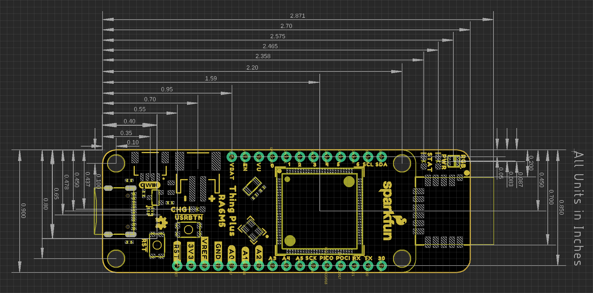{ width=750 }](./assets/board_files/dimensions.png "Click to enlarge")
<figcaption markdown>
[Dimensions (PDF)](./assets/board_files/dimensions.pdf) of the RA6M5 Thing Plus, in inches.
</figcaption>
</figure>


??? tip "Need more measurements?"
	For more information about the board's dimensions, users can download the [**Eagle files**](./assets/board_files/eagle_files.zip) for the board. These files can be opened in Eagle and additional measurements can be made with the dimensions tool.

	??? info ":octicons-download-16:{ .heart } Eagle - Free Download!"
		Eagle is a [CAD]("computer-aided design") program for electronics that is free to use for hobbyists and students. However, it does require an account registration to utilize the software.

		<center>
		[Download from<br>:autodesk-primary:{ .autodesk }](https://www.autodesk.com/products/eagle/free-download "Go to downloads page"){ .md-button .md-button--primary width="200px" }
		</center>

	??? info ":straight_ruler: Dimensions Tool"
		This video from Autodesk demonstrates how to utilize the dimensions tool in Eagle, to include additional measurements:

		<center>

		<div class="video">
		<iframe src="https://www.youtube.com/embed/dZLNd1FtNB8" title="EAGLE Dimension Tool" frameborder="0" allow="accelerometer; autoplay; clipboard-write; encrypted-media; gyroscope; picture-in-picture" allowfullscreen></iframe>

		{ .qr width=100 }
		</div>

		</center>


## USB Connector
The USB-C connector is used to provide power and program the board. For most users, it will also be the primary programming interface for the RA6M5 Thing Plus.


<figure markdown>
[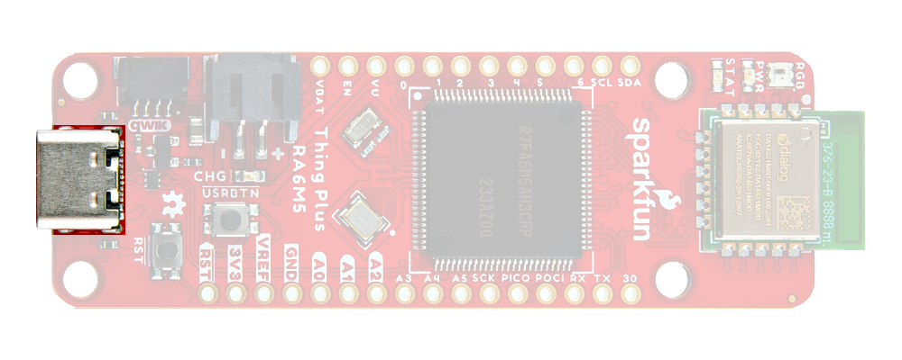{ width=750 }](./assets/img/hookup_guide/USB.png "Click to enlarge")
<figcaption markdown>USB-C connector on the RA6M5 Thing Plus.</figcaption>
</figure>


## Power
The RA6M5 Thing Plus only requires **3.3V** to power the board. However, the simplest method to power the board is through the USB-C connector. Alternatively, the `3V3`, `VBAT`, and `VUSB` pins can also be used to supply power to the board.


<div class="grid" style="grid-template-columns: 65% 35%;" markdown>

<div markdown>

<center>

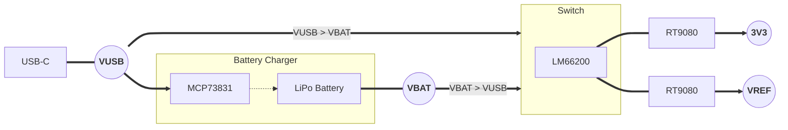
```mermaid

flowchart LR
	A[USB-C] === B(("`**VUSB**`")) ===> |VUSB > VBAT| Switch;

	subgraph Battery Charger
		direction LR
		C[MCP73831] -.-> D[LiPo Battery];
	end

	subgraph Switch
		F[LM66200];
	end

	B ==> C;
	D === E(("`**VBAT**`")) == VBAT > VUSB ==> Switch;

	F ===	H[RT9080] ==> I(("`**3V3**`"));
	F === G[RT9080] ==> J(("`**VREF**`"));

	click B "#vusb"
	click C "#charging-circuit"
	click E "#vbat"
	click F "#power-control"
	click J "#vref"
	click I "#3v3"
```

</center>


Below, is a summary of the power circuitry for this board:

=== ":material-power: `3V3`"
	* Primary power for the RA6M5 Thing Plus
		* Powers the RA6M5 module, DA14531MOD, QSPI flash, &micro;SD card slot, Qwiic connector, WS2812 RGB LED, and power LED
	* A regulated **3.3V** is provided by an [RT9080](./assets/component_documentation/RT9080.pdf) LDO from `VUSB` or `VBAT`
		* The output voltage from the RT9080 is controlled by the `EN` pin on the board
		* The RT9080 can source up to **600mA** of current, which is only limited by the power source from the LM66200 switch
			* The power source from the LM66200 is automatically switched between `VUSB` or `VBAT`, based on which has the greater voltage
	* As an input, it requires a **regulated 3.3V** to avoid contention with the LDO regulator

	!!! info "<span style="font-weight: 400;">The input voltage range for the RT9080 is 1.2-5.5V</span>"

=== ":material-usb-port: `VUSB`"
	* Usually powered through the USB-C connector *(**5V**)*
	* Input voltage range: **3.75 - 5V**
		* The maximum voltage is limited by the ideal diode switch at **5.5V** *(1.6-5.5V)*
		* The minimum voltage is limited by the charge controller at **3.75V** *(3.75-6V)*
	* Primary power source for the [RT9080 LDOs](./assets/component_documentation/RT9080.pdf) when `VUSB` > `VBAT`; via the LM66200 ideal diode switch
	* Powers the [MCP73831](./assets/component_documentation/MCP73831.pdf) linear charge management controller
		* Provides a **213mA** *(max)* rate of charge to a connected battery
=== ":material-battery-charging: `VBAT`"
	* The voltage from the JST battery connector; is meant for single-cell LiPo batteries
		* A connected battery will be charged by the [MCP73831 charge controller](./assets/component_documentation/MCP73831.pdf), when sufficient power is provided from `VUSB`
	* Primary power source for the  [RT9080 LDOs](./assets/component_documentation/RT9080.pdf) when `VBAT` > `VUSB`; via the LM66200 ideal diode switch
	* A battery's charge can be monitored through the [MAX17048](./assets/component_documentation/MAX17048.pdf) fuel gauge
=== ":material-sine-wave: :material-gauge: `VREF`"
	* The analog reference voltage for the RA6M5 module's ADC and DAC channels
		* Provided by a [RT9080](./assets/component_documentation/RT9080.pdf) LDO regulator, separate from one providing the `3V3` power supply

	!!! info "<span style="font-weight: 400;">The input voltage range for the RT9080 is 1.2-5.5V</span>"

=== ":material-format-line-style: `GND`"
	* The common ground or the 0V reference for the voltage supplies
=== ":material-connection: Qwiic Connector"
	* The 4-pin JST connector provides a regulated 3.3V voltage to peripheral Qwiic devices from `3V3`

</div>


<div markdown>

<figure markdown>
[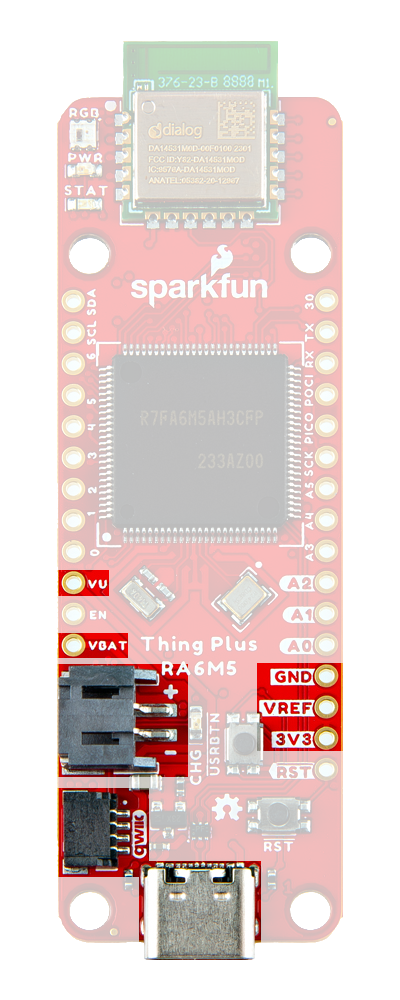{ width=200 }](./assets/img/hookup_guide/Power.png "Click to enlarge")
<figcaption markdown>Power connections on the RA6M5 Thing Plus PCB.</figcaption>
</figure>

</div>

</div>


??? info "Detailed Diagram"

	<center>
	
	```mermaid
	
	flowchart LR
		D === E(("`**VBAT**`")) == VBAT > VUSB ==> Switch;
		A[USB-C] === B(("`**VUSB**`")) == VUSB > VBAT ==> Switch;
		C --- T[CHG LED];
	
	subgraph Battery Charger
			C[MCP73831] -.-> D[LiPo<br>3.5-4.2V]
		end
	
		subgraph Switch
			S[LM66200];
			S === I[RT9080] & H[RT9080];
		end
	
		subgraph Powered_Components
			L[PWR LED];
			M[RA6M5] --- N[DA14531MOD];
			M --- O[QSPI Flash];
			M --- P[SD Card];
			M --- Q[WS2812 LED];
			M --- I2C;
			subgraph I2C
				R[Qwiic Connector];
				F[MAX17048];
			end
		end
	
		B ==> C;
		B ====> T;
		I --- U(("`**EN**`"));
		I ==> K(("`**3V3**`")) === Powered_Components;
		H ==> J(("`**VREF**`")) --> M;
		H --- W(("`**D37**`")) --- M;
		D ------ F;
		Switch --- V(("`**D38**`")) --- M;
	```

	</center>


*For more details, users can reference the [schematic](./assets/board_files/schematic.pdf) and the datasheets of the individual components in the power circuitry.*


### Power Status&nbsp; LED
The red, `PWR` LED will light up once **3.3V** is supplied to the board; however, for most users, it will light up when **5V** is supplied through the USB connection or when a LiPo battery is connected to the JST connector.


<figure markdown>
[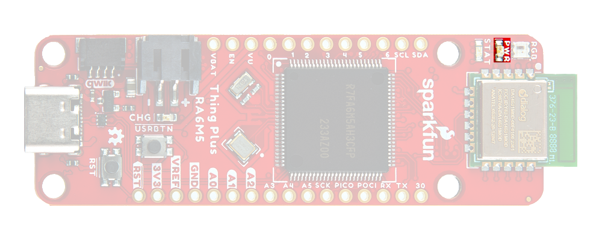{ width=750 }](./assets/img/hookup_guide/LED-pwr.png "Click to enlarge")
<figcaption markdown>The `PWR` status LED indicator on the RA6M5 Thing Plus.</figcaption>
</figure>


### Charging Circuit
The charging circuit utilizes the [MCP73831 linear charge management controller](./assets/component_documentation/MCP73831.pdf) from [Microchip Technologies](https://www.microchip.com/), which is powered by the USB-C connector or `VUSB`. The controller provides a **213mA** charge rate for a LiPo battery connected to the JST connector. Active charging is indicated by the yellow, `CHG` LED. If the charge controller is shut down or charging is complete, the `CHG` LED will turn off. The board also includes a [MAX17048 fuel gauge](./assets/component_documentation/MAX17048.pdf) from [Analog Devices](https://www.analog.com/) to monitor the charge left on the battery.


<center>

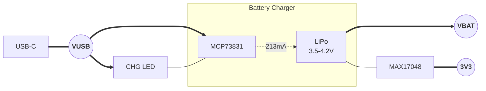
```mermaid

flowchart LR
	A[USB-C] === B(("`**VUSB**`")) ==> C & G;
	D ===> E(("`**VBAT**`"));
	D --- F[MAX17048] === H(("`**3V3**`"));
	G[CHG LED] --- C[MCP73831];

	subgraph Battery Charger
		C -.-> |213mA| D[LiPo<br>3.5-4.2V];
	end
```

</center>


<figure markdown>
[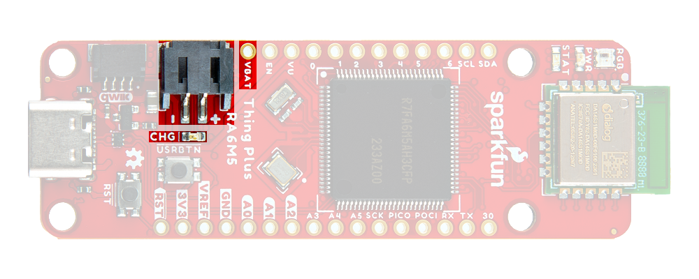{ width=750 }](./assets/img/hookup_guide/power-charging.png "Click to enlarge")
<figcaption markdown>The `CHG` status LED and JST connector for the battery on the RA6M5 Thing Plus.</figcaption>
</figure>


*For more details, please refer to the [MCP73831](./assets/component_documentation/MCP73831.pdf) and [MAX17048](./assets/component_documentation/MAX17048.pdf) datasheets, [schematic](./assets/board_files/schematic.pdf), and the [**Status LEDs**](#status-leds) and [**Battery Fuel Gauge**](#battery-fuel-gauge) sections below.*


### Power Control
The primary power source for the [RT9080 LDO regulators](./assets/component_documentation/RT9080.pdf) is automatically switched between `VUSB` and `VBAT` by the [LM66200 ideal diode switch](./assets/component_documentation/LM66200.pdf); based on their voltage levels. This will be indicated by the `ST` pin of the LM66200, which is connected to the `P001` GPIO *(`D38`)* of the RA6M5. A **`LOW`** state will indicate that power is being supplied from `VUSB` *(or the USB-C connector)*; while a **`HIGH`** state will indicate power is being drawn from `VBAT` *(or the battery JST connector)*.


<center>

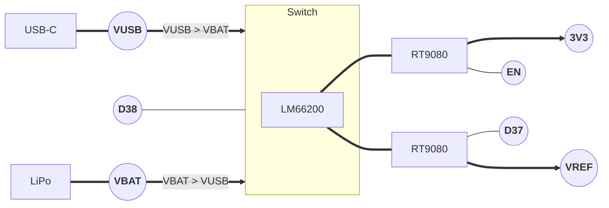
```mermaid

flowchart LR
	A[USB-C] === B(("`**VUSB**`")) == VUSB > VBAT ==> Switch;
	U(("`**D38**`")) --- Switch;
	D[LiPo] === E(("`**VBAT**`")) == VBAT > VUSB ==> Switch;

	subgraph Switch
		S[LM66200];
	end

	S === H[RT9080] ===> J(("`**3V3**`"));
	H --- T(("`**EN**`"));
	I --- V(("`**D37**`"));
	S === I[RT9080] ===> K(("`**VREF**`"));
```

</center>


The **3.3V** regulated output from the primary RT9080 is enabled by default and controlled by the `EN` pin on the board. Meanwhile, the voltage output from the RT9080 for the analog reference voltage *(`VREF`)* of the RA6M5 is controlled by its `P500` GPIO *(`D37`)*. Users can disable the 3.3V power output of either of the RT9080 LDO regulators, by setting the associated control pin **LOW**.


<figure markdown>
[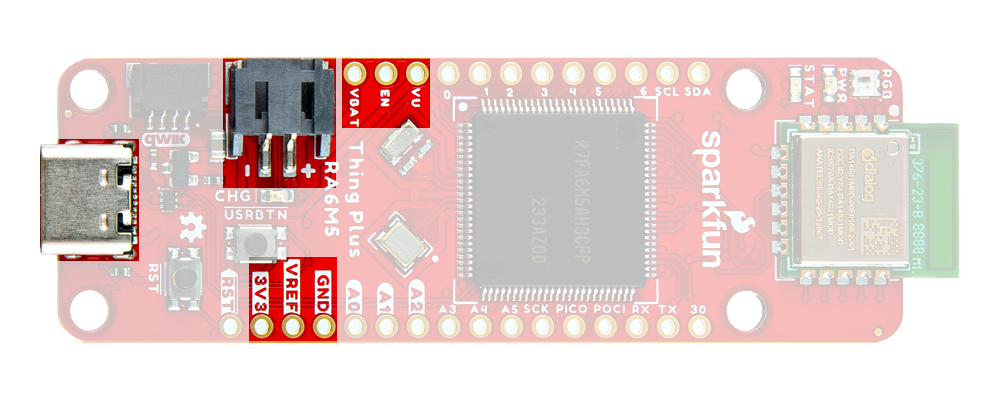{ width=750 }](./assets/img/hookup_guide/power_control.png "Click to enlarge")
<figcaption markdown>The power inputs/outputs and `EN` pin on the RA6M5 Thing Plus.</figcaption>
</figure>


*For more details, please refer to the [LM66200 datasheet](./assets/component_documentation/LM66200.pdf), [RT9080 datasheet](./assets/component_documentation/RT9080.pdf), and [schematic](./assets/board_files/schematic.pdf).*


<!-- Incomplete data
### Current Consumption
According to the specifications, the RA6M5 draws about **### mA** on average. With the BLE example in this tutorial, have measured it to average around **### mA** and peak at *### mA* while active. The table below summarizes the approximate current draw of the [RA6M5 Thing Plus](https://www.sparkfun.com/products/24243) for various cases and conditions. *(All current measurements were profiled with the [Nordic Power Profiler Kit II](https://www.nordicsemi.com/Products/Development-hardware/Power-Profiler-Kit-2).)*

<center>
<table>
<tbody>
	<tr>
		<th rowspan="2" style="vertical-align:middle; text-align:center">Operation</th>
		<th colspan="4" style="text-align:center">Avg. Current Draw</th>
	</tr>
	<tr>
		<td style="text-align:center">
			LiPo: <b>3.5V</b><br>
			<i>(Low < 5%)</i>
		</td>
		<td style="text-align:center">
			LiPo: <b>3.7V</b><br>
			<i>(~15%)</i>
		</td>
		<td style="text-align:center">
			LiPo: <b>4.2V</b><br>
			<i>(~100%)</i>
		</td>
		<td style="text-align:center; vertical-align:middle">
			USB-C: <b>5V</b><br>
			<i>(No Battery)</i>
		</td>
	</tr>
	<tr>
		<th style="vertical-align:middle">Idle (Blank Code)</th>
		<td style="vertical-align:middle; text-align:center;">
			63 mA<br>
			<i>86 mA (peak)</i>
		</td>
		<td style="vertical-align:middle; text-align:center;">
			63.5 mA<br>
			<i>89 mA (peak)</i>
		</td>
		<td style="vertical-align:middle; text-align:center;">
			64 mA<br>
			<i>88.6 mA (peak)</i>
		</td>
		<td style="vertical-align:middle; text-align:center;">
			67 mA<br>
			<i>89.9 mA (peak)</i>
		</td>
	</tr>
	<tr>
		<th style="vertical-align:middle">Idle: USB + Battery Power</th>
		<td style="vertical-align:middle; text-align:center;">
			--
		</td>
		<td style="vertical-align:middle; text-align:center;">
			--
		</td>
		<td style="vertical-align:middle; text-align:center;">
			90.5 &micro;A<br>
			<i>721 &micro;A (peak)</i>
		</td>
		<td style="vertical-align:middle; text-align:center;">
			N/A
		</td>
	</tr>
	<tr>
		<th style="vertical-align:middle">
			Idle: Battery Charging<br>
			<i>(Current from USB-C)</i>
		</th>
		<td style="vertical-align:middle; text-align:center;">
			395 mA<br>
			<i>420 mA (peak)</i>
		</td>
		<td style="vertical-align:middle; text-align:center;">
			590 mA<br>
			<i>600 mA (peak)</i>
		</td>
		<td style="vertical-align:middle; text-align:center;">
			&gt; 110 mA<br>
			<i>(before shutdown)</i>
		</td>
		<td style="vertical-align:middle; text-align:center;">
			N/A
		</td>
	</tr>
	<tr>
		<th style="vertical-align:middle">RGB <i>(White @ 100%)</i></th>
		<td style="vertical-align:middle; text-align:center;">
			78.4 mA<br>
			<i>105.9 mA (peak)</i>
		</td>
		<td style="vertical-align:middle; text-align:center;">
			79 mA<br>
			<i>106.8 mA (peak)</i>
		</td>
		<td style="vertical-align:middle; text-align:center;">
			79.9 mA<br>
			<i>105.3 mA (peak)</i>
		</td>
		<td style="vertical-align:middle; text-align:center;">
			82.5 mA<br>
			<i>108.2 mA (peak)</i>
		</td>
	</tr>
	<tr>
		<th style="vertical-align:middle">
			WiFi Example<br>
			<i>(Transceiving)</i>
		</th>
		<td style="vertical-align:middle; text-align:center;">
			135 mA<br>
			<i>295 mA (peak)</i>
		</td>
		<td style="vertical-align:middle; text-align:center;">
			137 mA<br>
			<i>310 mA (peak)</i>
		</td>
		<td style="vertical-align:middle; text-align:center;">
			137 mA<br>
			<i>307 mA (peak)</i>
		</td>
		<td style="vertical-align:middle; text-align:center;">
			140 mA<br>
			<i>300 mA (peak)</i>
		</td>
	</tr>
	<tr>
		<th style="vertical-align:middle">
			<a href="https://github.com/espressif/arduino-esp32/blob/master/libraries/ESP32/examples/DeepSleep/TouchWakeUp/TouchWakeUp.ino">Deep Sleep Example</a><br>
			<i>(MCU Inactive)</i>
		</th>
		<td style="vertical-align:middle; text-align:center;">
			2.5 mA<br>
			<i>2.95 mA (peak)</i>
		</td>
		<td style="vertical-align:middle; text-align:center;">
			2.5 mA<br>
			<i>3 mA (peak)</i>
		</td>
		<td style="vertical-align:middle; text-align:center;">
			2.55 mA<br>
			<i>3 mA (peak)</i>
		</td>
		<td style="vertical-align:middle; text-align:center;">
			2.85 mA<br>
			<i>3.3 mA (peak)</i>
		</td>
	</tr>
	<tr>
		<th style="vertical-align:middle">
			<a href="https://github.com/espressif/arduino-esp32/blob/master/libraries/ESP32/examples/DeepSleep/TouchWakeUp/TouchWakeUp.ino">Deep Sleep Example</a><br>
			<i>(MCU Inactive + Jumpers Cut)</i>
		</th>
		<td style="vertical-align:middle; text-align:center;">
			842 &micro;A<br>
			<i>1.24 mA (peak)</i>
		</td>
		<td style="vertical-align:middle; text-align:center;">
			848 &micro;A<br>
			<i>1.23 mA (peak)</i>
		</td>
		<td style="vertical-align:middle; text-align:center;">
			866 &micro;A<br>
			<i>1.24 mA (peak)</i>
		</td>
		<td style="vertical-align:middle; text-align:center;">
			1.19 mA<br>
			<i>1.58 mA (peak)</i>
		</td>
	</tr>
</tbody>
</table>
</center>

It is possible for users to reach sub-mA power consumption levels with the deep sleep power modes. Using the [`TimerWakeUp` Deep Sleep example code](https://github.com/espressif/arduino-esp32/blob/master/libraries/ESP32/examples/DeepSleep/TimerWakeUp/TimerWakeUp.ino), the LED jumpers cut, and powering the board through the LiPo battery connection we measured a power consumption of **845 &micro;A** *(990 &micro;A peak)* @ **3.7V** while the MCU was inactive.

<figure markdown>
[{ width="400" }](./assets/img/hookup_guide/measurement-ulp-from_batt.png "Click to enlarge")
<figcaption markdown>The current measurement from `VBAT` at **3.7V** during deep sleep.</figcaption>
</figure>


 -->


## :fontawesome-solid-microchip:&nbsp;RA6M5 Microcontroller
The brains of the board is the [RA6M5 microcontroller](https://www.renesas.com/us/en/document/dst/ra6m5-group-datasheet?r=1493931) from [Renesas](https://www.renesas.com/), a low-power Arm^®^ Cortex^®^-M33 processor with a clock speed up to 200Mhz, 512kB of SRAM, and 2MB of flash memory. This high-performance microcontroller features an extensive list of peripheral capabilities and is perfect for real-time applications.


<div class="grid" markdown>

<div markdown>

<figure markdown>
[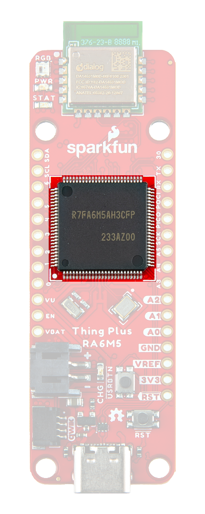{ width=270 }](./assets/img/hookup_guide/RA6M5.png "Click to enlarge")
<figcaption markdown>The RA6M5 microcontroller on the RA6M5 Thing Plus.</figcaption>
</figure>

</div>


<div markdown>

* Arm^®^ Cortex^®^-M33 Core
	* Clock Frequency: 200MHz
	* Flash Memory: 2MB *(code)*; 8kB *(data)*
	* SRAM: 512kB w/ ECC Support
	* Arm Memory Protection Unit (Arm MPU)
	* Secure Crypto Engine
	* Two Watchdog Timers (WDT)
* Operating Voltage: 3.0V to 3.6V
	* Current Consumption:
		* Maximum: 143mA
		* Normal: 32mA
		* Sleep: 11mA
		* Deep Sleep: 0.9-131&micro;A
* Operating modes:
	* Single-chip or SCI/USB boot
* Operating Temperature: -40 to 85 &deg;C
* 75 GPIO Pins
* RTC with Calendar
* CRC Calculator
* Internal Temperature Sensor

</div>


<div markdown>

**Peripherals**

* 12-bit ADC (x6)
* 12-bit DAC (x2)
* 32-bit PWM Channels (x4)
* 16-bit PWM Channels (x6)
* UART (x10)
* I^2^C Bus (x3)
* SPI Bus (x2)
* QSPI (x1)
* SD/MMC Host Interface

{--

* OSPI (x1)
* CAN Interface
* USB 2.0 (Full/High Speed)
* Ethernet MAC/DMA Controller
* Serial Sound Interface Enhanced
* Consumer Electronics Control
* Capacitive Touch Sensing

--}

!!! warning "Note"
	Users should be aware that not all of the features, listed above, will be available in the Arduino IDE.

</div>

</div>


??? success "DFU Mode"
	If users are having issues uploading code to the board, the RA6M5 can be manually forced into DFU mode. This issue, often occurs when the USB connection is busy and a reset can't be triggered on the RA6M5, to initialize the upload process. To force the RA6M5 Thing Plus into DFU mode:

	1. Double-tap the ++"RST"++ button
		- The `STAT` LED should be fading in/out very slowly
	1. Users should now, be able to upload a new program
		- It shouldn't be necessary to select a COM port in the Arduino IDE; only the board needs to be selected
	1. Once programming is complete, the MCU should reboot on its own. Otherwise:
		- Press the ++"RST"++ button
		- Power cycle the board


*For more technical specifications for the RA6M5 microcontroller, please refer to the [RA6M5 datasheet](https://www.renesas.com/us/en/document/dst/ra6m5-group-datasheet?r=1493931) and [RA6M5 user manual](https://www.renesas.com/us/en/document/man/ra6m5-group-users-manual-hardware?r=1493931).*


### Debugging Pins
Debug pins are available for the RA6M5, as 0.1" test points on the board. However, the debugging feature is only available through the [Renesas FSP](https://www.renesas.com/us/en/software-tool/flexible-software-package-fsp) *(not covered in this tutorial)*.


<div class="grid" markdown>

<div markdown>

=== "SWD"
	<!-- <center>
		<table border="1" markdown>
			<tr markdown>
				<td style="text-align:center" markdown>---</td>
			</tr>
			<tr markdown>
				<td style="text-align:center" markdown>**3.3V**</td>
				<td style="text-align:center" markdown>**SWDIO**</td>
			</tr>
			<tr markdown>
				<td style="text-align:center" markdown>**SWCLK**</td>
				<td style="text-align:center" markdown>**SWO**</td>
			</tr>
			<tr markdown>
				<td style="text-align:center" markdown>**GND**</td>
				<td style="text-align:center" markdown>**RST**</td>
			</tr>
		</table>
	</center> -->

	<center>
		<table border="1" markdown>
			<tr markdown>
				<td style="text-align:center" markdown>**GND**</td>
				<td style="text-align:center" markdown>**SWCLK**</td>
				<td style="text-align:center" markdown>**3.3V**</td>
				<td style="text-align:center" markdown>**|**</td>
			</tr>
			<tr markdown>
				<td style="text-align:center" markdown>**RST**</td>
				<td style="text-align:center" markdown>**SWO**</td>
				<td style="text-align:center" markdown>**SWDIO**</td>
			</tr>
		</table>
	</center>

=== "JTAG"
	<!-- <center>
		<table border="1" markdown>
			<tr markdown>
				<td style="text-align:center" markdown>---</td>
			</tr>
			<tr markdown>
				<td style="text-align:center" markdown>**3.3V**</td>
				<td style="text-align:center" markdown>**TMS**</td>
			</tr>
			<tr markdown>
				<td style="text-align:center" markdown>**TCK**</td>
				<td style="text-align:center" markdown>**TDO**</td>
			</tr>
			<tr markdown>
				<td style="text-align:center" markdown>**GND**</td>
				<td style="text-align:center" markdown>**RST**</td>
			</tr>
		</table>
	</center> -->

	<center>
		<table border="1" markdown>
			<tr markdown>
				<td style="text-align:center" markdown>**GND**</td>
				<td style="text-align:center" markdown>**TCK**</td>
				<td style="text-align:center" markdown>**3.3V**</td>
				<td style="text-align:center" markdown>**|**</td>
			</tr>
			<tr markdown>
				<td style="text-align:center" markdown>**RST**</td>
				<td style="text-align:center" markdown>**TDO**</td>
				<td style="text-align:center" markdown>**TMS**</td>
			</tr>
		</table>
	</center>


!!! info "Pin Connections"
	In case users are interested, these are the pin connections of the debugging test points for the RA6M5. For more details, please reference the [schematic](./assets/board_files/schematic.pdf) and [**Eagle files**](./assets/board_files/eagle_files.zip).

	- `TMS`/`SWDIO`: `P108`
	- `TCK`/`SWCLK`: `P300`
	- `TDO`/`SWO`: `P109`
	- {--`TDI`: `P110` (POCI/`D17`)--} ***(Not a JTAG test point)***

!!! note
	In order to debug the RA6M5, users will need a debug probe. We recommend the [J-Link debug probes from Segger](https://www.segger.com/products/debug-probes/j-link/). However, users should verify the supported devices before purchasing these products; for example, we had a few issues with the [J-Link EDU Mini](https://www.sparkfun.com/products/24078).


</div>


<div markdown>

<figure markdown>
[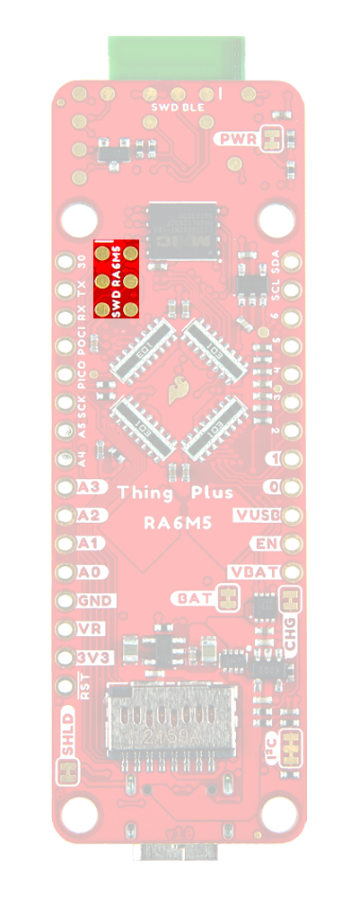{ width=200 }](./assets/img/hookup_guide/debug-RA6M5.png "Click to enlarge")
<figcaption markdown>The debug pins for the RA6M5 microcontroller.</figcaption>
</figure>

</div>

</div>


*For more details, please refer to the [schematic](./assets/board_files/schematic.pdf) and [RA6M5 datasheet](https://www.renesas.com/us/en/document/dst/ra6m5-group-datasheet?r=1493931).*


### Pin Functions
While there are **75 GPIO pins** that are available on the RA6M5, only **44 GPIO pins are utilized** with the RA6M5 Thing Plus. Additionally, of those 44 GPIO, only **21 GPIO pins** are broken out into the PTH breakout pins. The breakout pins are in a Feather form-factor layout with a 0.1" pitch spacing to make them compatible with [standard headers](https://www.sparkfun.com/categories/381) and [Feather shields/*wings*](https://www.sparkfun.com/categories/tags/feather).

Some of the RA6M5's peripheral capabilities may be inaccessible to users with the **available 44 GPIO**. However, any of the available GPIO pins can operate as **digital I/O**; with several of these pins featuring additional peripheral support. The pins utilized by the RA6M5 Thing Plus, along with their capabilities, are summarized in our [graphical datasheet](./assets/board_files/graphical_datasheet.pdf) and detailed in the sections below.


<center>
[:material-download:{ .heart }&nbsp;&nbsp;Download the Graphical Datasheet<br>{ .tinyqr }](./assets/board_files/graphical_datasheet.pdf "Click to download the graphical datasheet"){ .md-button .md-button--primary }
</center>


<div class="grid" markdown>

<div markdown>

<figure markdown>
[{ width="500" }](./assets/img/hookup_guide/graphical_datasheet-front.png "Click to enlarge")
</figure>

</div>


<div markdown>

<figure markdown>
[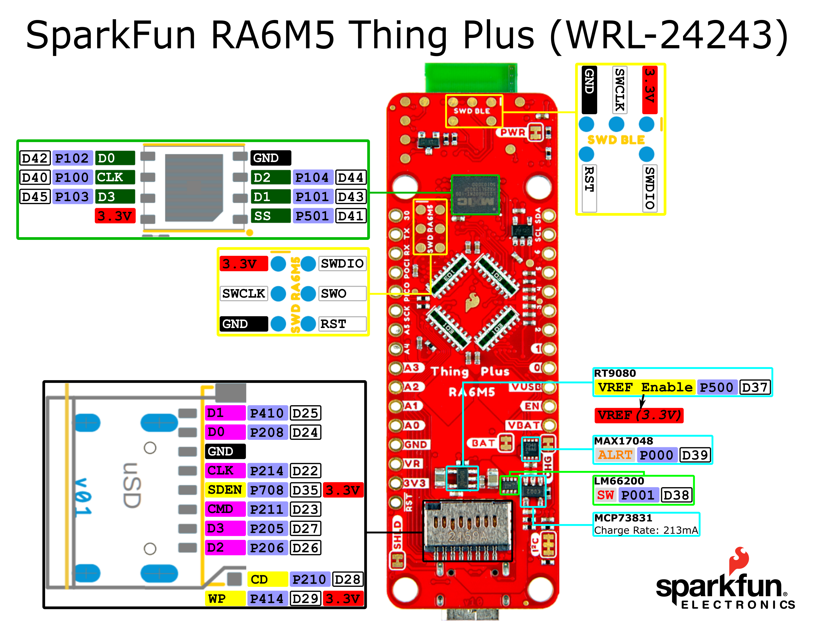{ width="500" }](./assets/img/hookup_guide/graphical_datasheet-back.png "Click to enlarge")
</figure>

</div>

</div>


!!! arduino "Board Limitations"
	Users should be aware that some of the features of the RA6M5 may not be available in the Arduino IDE. This is due to either the lack of support in the [Renesas-Arduino core](https://github.com/arduino/ArduinoCore-renesas) and/or pins that are unavailable on the RA6M5 Thing Plus. *For the full capabilities of the RA6M5, the [Renesas FSP](https://www.renesas.com/us/en/software-tool/flexible-software-package-fsp) should be utilized.*


	<div class="grid" markdown>

	<div markdown>

	- Only one I<sup>2</sup>C bus is defined.
	- Only three UART interfaces are defined.
		- `Serial` - UART (USB)
		- `Serial1` - `RX`/`TX` GPIO Pins
		- `Serial2` - DA14531MOD UART
	- Only one SPI bus is defined.

	</div>


	<div markdown>

	!!! warning "Note"
		- All the GPIO on the RA6M5 Thing Plus are :high_voltage: **3.3V** pins
		- While the datasheet specifies there are fourteen 5V-tolerant I/O pins; most of the exposed pins are **not 5V-tolerant**! To interface with higher voltage components, a [**logic-level adapter**](https://learn.sparkfun.com/tutorials/147) should be utilized.

	</div>

	</div>


=== ":material-square-wave: Digital I/O"
	Any GPIO pin on the RA6M5 Thing Plus can operate as a digital I/O *(input or output)*. To access this functionality in the Arduino IDE, users must first declare the pin operation in their `#!cpp setup()` loop, using the [`#!cpp pinMode(pin, mode)` function](https://www.arduino.cc/reference/en/language/functions/digital-io/pinmode/).

	**Input**

	:	If a pin is configured as an `INPUT`, the microcontroller can monitor if the pin's state is **HIGH** or **LOW**. As **Input** pins are **High Impedance**, it takes very little current to move the input pin from one state to another.

		!!! arduino
			In the Arduino IDE, this is accessed through the [`#!cpp digitalRead(pin)` function](https://www.arduino.cc/reference/en/language/functions/digital-io/digitalread/), which returns a `HIGH` or `LOW` value.

	**Output**

	:	If a pin is configured as an `OUTPUT`, the microcontroller can provide a **HIGH** or **LOW** voltage output from the pin. As **Output** pins are **Low Impedance**, they can provide a certain amount of current for other circuits.

		!!! arduino
			In the Arduino IDE, this is accessed through the [`#!cpp digitalWrite(pin, value)` function](https://www.arduino.cc/reference/en/language/functions/digital-io/digitalwrite/) and providing a `HIGH` or `LOW` value.

		!!! warning
			There are electrical limitations to the amount of current that I/O pins can sink or source. For more details, check out the [RA6M5 datasheet](https://www.renesas.com/us/en/document/dst/ra6m5-group-datasheet?r=1493931).

	!!! tip "Tip - Creating a PWM Output"
		A digital output pin can only either be fully on **HIGH** or fully off **LOW**. By turning a digital pin's output, on and off very quickly with precise timings, the average voltage can be controlled and emulate an analog output. This method is called [PWM](https://docs.arduino.cc/learn/microcontrollers/analog-output/).
		
		*Please refer to the [PWM Outputs](#pwm-outputs) tab for more instructions or check out this great [tutorial](https://learn.sparkfun.com/tutorials/pulse-width-modulation) to learn more about pulse width modulation.*


=== ":material-square-wave: PWM Outputs"
	The RA6M5 supports up to **four 32-bit** and **six 16-bit PWM** (Pulse Width Modulation) channels on most of its GPIO pins. A PWM output will produce a square waveform with a variable duty cycle, a ratio of time a signal is **HIGH** for a given wave period. In the Arduino IDE, this feature is accessed using the [`#!cpp analogWrite(pin, value)` function](https://www.arduino.cc/reference/en/language/functions/analog-io/analogwrite/), where the desired duty cycle is specified as an 8-bit `value`.


	$$
	\operatorname{Duty-Cycle}=\frac{value_{\operatorname{(8-bit)}}}{255_{(\operatorname{8-bit})}} = \frac{time_{HIGH}}{time_{Total}}=\frac{t_{HIGH}}{t_{LOW} + t_{HIGH}}
	$$


	<div class="grid" markdown>

	<div markdown>

	<figure markdown>
	[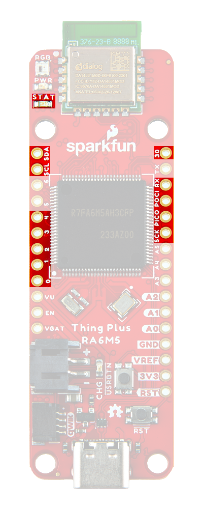{ width=200 }](./assets/img/hookup_guide/pins-pwm.png "Click to enlarge")
	<figcaption markdown>The GPIO pins that support PWM outputs on the RA6M5 Thing Plus.</figcaption>
	</figure>

	</div>


	<div markdown>

	??? warning "Mean Value &ne; Analog"
		PWM signals are often mistaken for analog signals; however, a PWM output is not a **true** analog signal. These signals can *emulate an analog output*, based on the average voltage output of their square waveform for a specific duration of time.


	!!! arduino
		By default, in the Arduino IDE, `analogWrite()` accepts an 8-bit value. To change the resolution of the PWM signal for the `#!cpp analogWrite()` function, use the [`#!cpp analogWriteResolution(bits)` function](https://www.arduino.cc/reference/en/language/functions/zero-due-mkr-family/analogwriteresolution/).

		*A PWM output is not a true analog signal. For a true analog output, please refer to the [**Analog Outputs** tab](#analog-outputs).*


	!!! tip
		To learn more about pulse width modulation (PWM), check out this great [tutorial](https://learn.sparkfun.com/tutorials/51).

		<div class="grid cards" markdown align="center">

		-   <a href="https://learn.sparkfun.com/tutorials/51">
			<figure markdown>
			
			</figure>

			---

			**Pulse Width Modulation**</a>

		</div>

	</div>

	</div>


=== ":material-sine-wave: Analog Inputs"
	The RA6M5 has six **12-bit ADC** channels on its GPIO pins to read analog signals. This functionality is accessed in the Arduino IDE using the [`#!cpp analogRead(pin)` function](https://www.arduino.cc/reference/en/language/functions/analog-io/analogread/). *The available ADC pins are highlighted in the image below.*


	<div class="grid" markdown>

	<div markdown>

	<figure markdown>
	[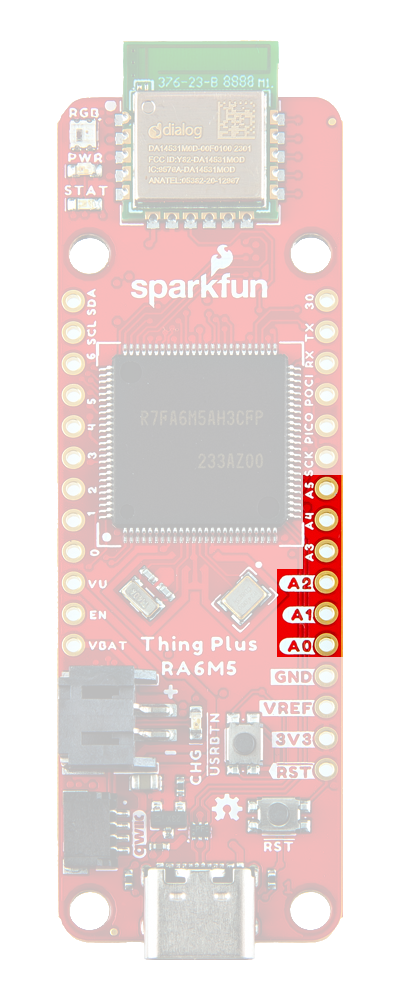{ width=200 }](./assets/img/hookup_guide/pins-adc.png "Click to enlarge")
	<figcaption markdown>Analog input pins on the RA6M5 Thing Plus.</figcaption>
	</figure>

	</div>


	<div markdown>

	!!! arduino
		In the Arduino IDE, `#!cpp analogRead()` returns a 10-bit value by default. To change the resolution of the value returned by the `#!cpp analogRead()` function, use the [`#!cpp analogReadResolution(bits)` function](https://www.arduino.cc/reference/en/language/functions/zero-due-mkr-family/analogreadresolution/).

	!!! tip
		To learn more about analog vs. digital signals, check out this great [tutorial](https://learn.sparkfun.com/tutorials/35).

		<div class="grid cards" markdown align="center">

		-   <a href="https://learn.sparkfun.com/tutorials/35">
			<figure markdown>
			
			</figure>

			---

			**Analog to Digital Conversion**</a>

		</div>

	</div>

	</div>


=== ":material-sine-wave: Analog Outputs"
	The RA6M5 has two **12-bit DAC** channels on its GPIO pins to output analog signals. This feature is accessed in the Arduino IDE using the [`#!cpp AnalogWave` library from the Renesas Arduino core](https://github.com/arduino/ArduinoCore-renesas/tree/main/libraries/AnalogWave). *The available DAC pins are highlighted in the image below.*


	<div class="grid" markdown>

	<div markdown>

	<center>

	| GPIO Pin | DAC Channel |
	| :------: | :---------- |
	| `A0`     | `DAC`       |
	| `A1`     | `DAC1`      |

	</center>


	<figure markdown>
	[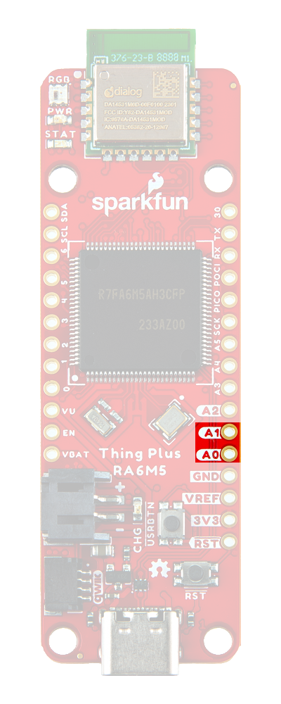{ width=200 }](./assets/img/hookup_guide/pins-dac.png "Click to enlarge")
	<figcaption markdown>Analog (DAC) output pins on the RA6M5 Thing Plus.</figcaption>
	</figure>

	</div>


	<div markdown>

	!!! arduino
		When implementing the `AnalogWave` library, users will need to link the library and create an instance of the `analogWave` class with a DAC `pin` declared for the output.

		```c++
		#include "analogWave.h" // Include the library for analog waveform generation

		analogWave wave(pin);   // Create an instance of the analogWave class, using a DAC pin
		```

		*For more information, please refer to the [Analog I/O example](../example-analog/#analogwave-library) in this guide.*


	!!! tip
		To learn more about analog vs. digital signals, check out this great [tutorial](https://learn.sparkfun.com/tutorials/89).

		<div class="grid cards" markdown align="center">

		-   <a href="https://learn.sparkfun.com/tutorials/89">
			<figure markdown>
			
			</figure>

			---

			**Analog vs. Digital**</a>

		</div>

	</div>

	</div>


=== "Serial Pins"
	The RA6M5 supports up to ten UART ports. However, only the three UART ports are predefined in the Renesas Arduino core. In the Arduino IDE, the [serial communication class](https://www.arduino.cc/reference/en/language/functions/communication/serial/) is used for the USB connection (`#!cpp Serial`), the labeled UART I/O pins on the board (`#!cpp Serial1`), and UART connection to the DA14531MOD (`#!cpp Serial2`).


	<div class="grid" markdown>

	<div markdown>

	<figure markdown>
	[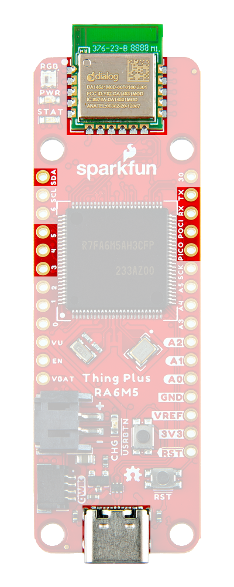{ width=200 }](./assets/img/hookup_guide/pins-serial.png "Click to enlarge")
	<figcaption markdown>UART connections on the RA6M5 Thing Plus.</figcaption>
	</figure>

	</div>


	<div markdown>

	!!! arduino
		By default, in the Arduino IDE, the RA6M5 Thing Plus board definition supports:

		<center>

		| Arduino Object | GPIO Pins   | Connection |
		| :------------- | :---------- | :--------: |
		| `Serial`       |             | **USB**    |
		| `Serial1`      | **RX** - `P408` *(`D21`)*<br>**TX** - `P409` *(`D20`)* | PTH Pins |
		| `Serial2`      | **RX** - `P601` *(`D32`)*<br>**TX** - `P602` *(`D31`)*<br>**RTS** - `P301` *(`D33`)*<br>**CTS** - `P303` *(`D34`)* | **DA14531MOD**<br>*Bluetooth Module* |

		</center>

		To utilize serial communication on other pins, users will need to create a custom serial port object and declare which pins to access.

		
		??? warning "Shared UART Port"
			Users should be aware that the UART port for pins `D17`/`D18`, **UART9**, is also utilized for communication with the DA14531MOD Bluetooth module. Therefore, if **UART9** is already being utilized for the DA14531MOD; the UART port will be unavailable on pins `D17`/`D18`.

			<center>

			| UART Port | Arduino Object | GPIO Pins   | Connection |
			| :-------: | :------------- | :---------- | :--------: |
			| **USB**   | `Serial`       |             | **USB**    |
			| **UART3** | `Serial1`      | **RX** - `P408` *(`D21`)*<br>**TX** - `P409` *(`D20`)* | PTH Pins |
			| **UART9** | `Serial2`      | **RX** - `P601` *(`D32`)*<br>**TX** - `P602` *(`D31`)*<br>**RTS** - `P301` *(`D33`)*<br>**CTS** - `P303` *(`D34`)* | **DA14531MOD**<br>*Bluetooth Module* |
			| **UART9** |                | **RX** - `P110` *(`D17`)*<br>**TX** - `P109` *(`D18`)* | PTH Pins |
			| **UART7** |                | **RX** - `P402` *(`D05`)*<br>**TX** - `P401` *(`D15`)*<br>**RTS** - `P403` *(`D04`)*<br>**CTS** - `P404` *(`D03`)*  | PTH Pins |

			</center>


	!!! tip
		To learn more about serial communication, check out this great [tutorial](https://learn.sparkfun.com/tutorials/8).

		<div class="grid cards" markdown align="center">

		-   <a href="https://learn.sparkfun.com/tutorials/8">
			<figure markdown>
			
			</figure>

			---

			**Serial Communication**</a>

		</div>

	</div>

	</div>


=== "SPI Pins"
	The RA6M5 supports up to two SPI buses. However, only a single SPI port is defined in the Renesas Arduino core. In the Arduino IDE, the [SPI communication class](https://www.arduino.cc/en/reference/SPI) is configured to utilize pins SCK - `P111`/`D19`, POCI - `P110`/`D17`, PICO - `P109`/`D18`, and `P112`/`D0` for its chip select.


	??? note "New Nomenclature"
		To comply with the latest [OSHW](https://www.oshwa.org/) design practices, we have [adopted the new SPI signal nomenclature](https://www.sparkfun.com/spi_signal_names) (`SDO`/`SDI` and `PICO`/`POCI`). The terms **Master** and **Slave** are now referred to as **Controller** and **Peripheral**. The `MOSI` signal on a controller has been replaced with `SDO` or `PICO`. Please refer to this [announcement on the decision to deprecate the `MOSI`/`MISO` terminology and transition to the `SDO`/`SDI` naming convention](https://www.oshwa.org/a-resolution-to-redefine-spi-signal-names).


	<div class="grid" markdown>

	<div markdown>

	<figure markdown>
	[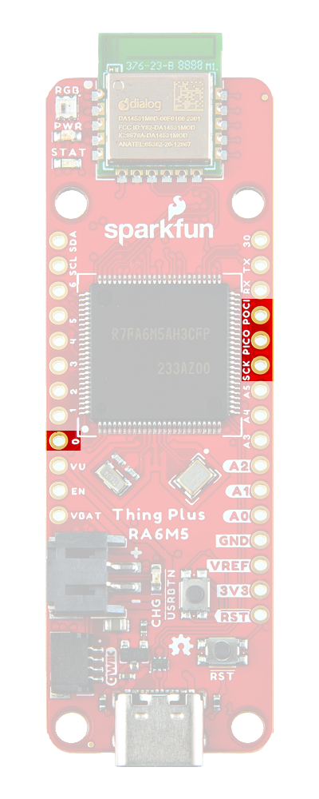{ width=200 }](./assets/img/hookup_guide/pins-spi.png "Click to enlarge")
	<figcaption markdown>SPI pins on the RA6M5 Thing Plus.</figcaption>
	</figure>

	</div>


	<div markdown>

	!!! arduino
		By default, in the Arduino IDE, the RA6M5 Thing Plus board definition supports:

		<center>

		| SPI Pin | GPIO             |
		| :-----: | :--------------- |
		| POCI    | `P110` *(`D17`)* |
		| PICO    | `P109` *(`D18`)* |
		| SCK     | `P111` *(`D19`)* |
		| CS      | `P112` *(`D0`)*  |

		</center>

		To utilize SPI communication on other pins, users will need to create a custom SPI object and declare which pins to access.


	!!! tip
		To learn more about the serial peripheral interface (SPI) protocol, check out this great [tutorial](https://learn.sparkfun.com/tutorials/16).

		<div class="grid cards" markdown align="center">

		-   <a href="https://learn.sparkfun.com/tutorials/16">
			<figure markdown>
			
			</figure>

			---

			**Serial Peripheral Interface (SPI)**</a>

		</div>

	</div>

	</div>


=== "<abbr title="Inter-Integrated Circuit">I^2^C</abbr> Pins"
	The RA6M5 supports up to three I^2^C buses. However, only a single I^2^C bus is defined in the Renesas Arduino core. In the Arduino IDE, the [Wire class](https://www.arduino.cc/en/reference/wire) is configured to utilize the SDA - `P401`/`D15` and SCL -`P400`/`D16` pins. These pins also share the same I^2^C bus as the [Qwiic connector](#qwiic-connector) and [MAX17048 fuel gauge](#battery-fuel-gauge).

	<div class="grid" markdown>

	<div markdown>

	<figure markdown>
	[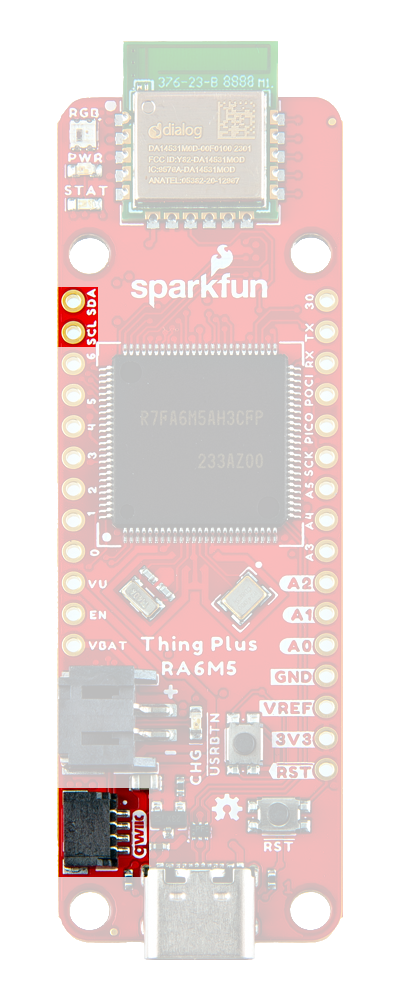{ width=200 }](./assets/img/hookup_guide/pins-i2c.png "Click to enlarge")
	<figcaption markdown>I^2^C connections on the RA6M5 Thing Plus.</figcaption>
	</figure>

	</div>


	<div markdown>

	!!! arduino
		By default, in the Arduino IDE, the RA6M5 Thing Plus board definition supports:

		<center>

		| I^2^C Pin | GPIO             |
		| :-------: | :--------------- |
		| SCL       | `P400` *(`D16`)* |
		| SDA       | `P401` *(`D15`)* |


		</center>

		To utilize the I^2^C ports on other pins, users will need to create a custom Wire object and declare which pins to access.


	!!! tip
		To learn more about the inter-integrated circuit (I^2^C) protocol, check out this great [tutorial](https://learn.sparkfun.com/tutorials/82).

		<div class="grid cards" markdown align="center">

		-   <a href="https://learn.sparkfun.com/tutorials/82">
			<figure markdown>
			
			</figure>

			---

			**I2C**</a>

		</div>

	</div>

	</div>


	??? tip "What is Qwiic?"

		<div class="grid" markdown>

		<div markdown>

		<!-- Qwiic Banner -->
		<center>
		[{ width=400 }](https://www.sparkfun.com/qwiic)
		[{ width=400 }](https://www.sparkfun.com/qwiic)
		</center>

		---

		The [Qwiic connect system](https://www.sparkfun.com/qwiic) is a solderless, polarized connection system that allows users to seamlessly daisy chain 	I^2^C boards together. Play the video, to learn more about the Qwiic connect system or click on the banner above to learn more about [Qwiic 	products](https://www.sparkfun.com/qwiic).

		</div>


		<div style="max-height=400px;" markdown>

		<center>
		<div class="video-container">
		<iframe src="https://www.youtube.com/embed/x0RDEHqFIF8" title="SparkFun's Qwiic Connect System" frameborder="0" allow="accelerometer; 	encrypted-media; gyroscope; picture-in-picture" allowfullscreen></iframe>

		{ .qr width=100 }
		</div>
		</center>

		</div>

		</div>

		!!! info "Features of the Qwiic System"

			=== "No Soldering"

				{ align="left" width="90" }
				{ align="left" width="90" }

				Qwiic cables (4-pin JST) plug easily from development boards to sensors, shields, accessory boards and more, making easy work of setting up a new prototype.

			=== "Polarized Connector"

				{ align="left" width="90" }
				{ align="left" width="90" }

				There's no need to worry about accidentally swapping the `SDA` and `SCL` wires on your breadboard. The Qwiic connector is polarized so you know you’ll have it wired correctly every time.

				The part numbers for the PCB connector is `SM04B-SRSS` ([Datasheet](https://cdn.sparkfun.com/assets/parts/1/2/2/8/9/Qwiic_Connector_Datasheet.pdf)) and the mating connector on the cables is `SHR04V-S-B`; or an equivalent *1mm pitch, 4-pin JST connection*.

			=== "Daisy Chain-able"

				{ align="left" width="90" }
				{ align="left" width="90" }

				It’s time to leverage the power of the I^2^C bus! Most Qwiic boards will have two or more connectors on them, allowing multiple devices to be connected.


=== "Interrupts"
	The RA6M5 provides IRQ support on several of its pins. In the Arduino IDE, interrupt requests are configured using the [`#!cpp attachInterrupt(digitalPinToInterrupt(pin), ISR, mode)` function](https://www.arduino.cc/reference/en/language/functions/external-interrupts/attachinterrupt/). *The available IRQ pins are highlighted in the image below.*


	<div class="grid" markdown>

	<div markdown>

	<figure markdown>
	[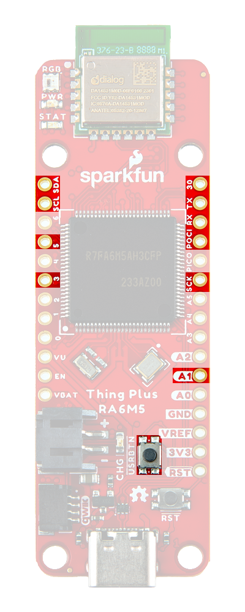{ width=200 }](./assets/img/hookup_guide/pins-int.png "Click to enlarge")
	<figcaption markdown>Interrupt request pins on the RA6M5 Thing Plus.</figcaption>
	</figure>

	</div>


	<div markdown>

	!!! arduino
		In the Arduino IDE, interrupt requests are configured using the [`#!cpp attachInterrupt(digitalPinToInterrupt(pin), ISR, mode)` function](https://www.arduino.cc/reference/en/language/functions/external-interrupts/attachinterrupt/), where:

		- `pin` - The GPIO pin
		- `ISR` -	The interrupt service routine to call/execute when the interrupt occurs
		- `mode` - Defines how the interrupt should be triggered:
			- `LOW` - When the pin is **LOW**
			- `CHANGE` - Whenever the pin changes value
			- `RISING` - When the pin changes from **LOW** to **HIGH**
			- `FALLING`- When the pin changes from **HIGH** to **LOW**

	!!! tip
		To learn more about interrupts, check out this great [tutorial](https://learn.sparkfun.com/tutorials/316).

		<div class="grid cards" markdown align="center">

		-   <a href="https://learn.sparkfun.com/tutorials/316">
			<figure markdown>
			
			</figure>

			---

			**Processor Interrupts with Arduino**</a>

		</div>

	</div>

	</div>


<!-- SSI???
=== ":material-music: I2S or SSI?"
	The RA6M5 provides peripheral support for a serial sound interface. However, this is not natively supported with in the Renesas-Arcuino core. Users will need to utilize Renesas's [FSP](https://renesas.github.io/rza-fsp/group___s_s_i.html) to enable this peripheral.


	<div class="grid" markdown>

	<div markdown>

	<figure markdown>
	[{ width=500 }](https://renesas.github.io/rza-fsp/r_ssi_frame_diagram.PNG "Click to enlarge")
	<figcaption markdown>Communication protocol for the serial sound interface.</figcaption>
	</figure>

	</div>


	<div markdown>

	- AUD_CLK: `P400` *(`D16`)*
	- AUD_CLK: `P402` *(`D5`)*
	- BCK0: `P403` *(`D4`)*
	- LRCK0: `P404` *(`D3`)*
	- TXD0: `P405` *(`D2`)*
	- RXD0: `P406` *(`D1`)*

	</div>

	</div>
-->


<!-- CAN Bus - not supported???
??? info "CAN Bus Support"
	Diving into the [RA6M5 datasheet](https://www.renesas.com/us/en/document/dst/ra6m5-group-datasheet?r=1493931), users may notice that there are CAN buses supported on a few of the available hardware pins. However, please refer to the [RA6M5 user manual](https://www.renesas.com/us/en/document/man/ra6m5-group-users-manual-hardware?r=1493931) for the protocol implementation. *(i.e. There could be a bus contention issues with the `CAN1` pins, which share `UART9` with the Bluetooth module.)*

	<center>

	| CAN Bus  | GPIO Pins                                              |
	| :------: | :----------------------------------------------------- |
	| **CAN0** | **RX** - `P402` *(`D05`)*<br>**TX** - `P401` *(`D15`)* |
	| **CAN1** | **RX** - `P110` *(`D17`)*<br>**TX** - `P109` *(`D18`)* |

	</center>
-->


---


*For more technical specifications on the **I/O** pins, please refer to the [schematic](./assets/board_files/schematic.pdf), [RA6M5 datasheet](https://www.renesas.com/us/en/document/dst/ra6m5-group-datasheet?r=1493931), and [RA6M5 user manual](https://www.renesas.com/us/en/document/man/ra6m5-group-users-manual-hardware?r=1493931).*


## :material-bluetooth:&nbsp;DA14531MOD BLE Module
The [DA14531MOD](https://www.renesas.com/us/en/document/dst/da14531-module-datasheet), from [Renesas](https://www.renesas.com/), provides the RA6M5 Thing Plus with Bluetooth connectivity. When actively transmitting, the DA14531MOD sips a mere 4mA; low enough to operate on a small coin-cell battery. The module is programmed with a precompiled binary of the CodeLess SDK, featuring Renesas' [SmartBond™ - CodeLess™ AT command](https://lpccs-docs.renesas.com/UM-140-DA145x-CodeLess/index.html) set. With the implementation of an AT command platform to configure the DA1431MOD's Bluetooth connectivity, source code is no longer required to be written for the module, to operate as a peripheral device.


<div class="grid" markdown>

<div markdown>

<figure markdown>
[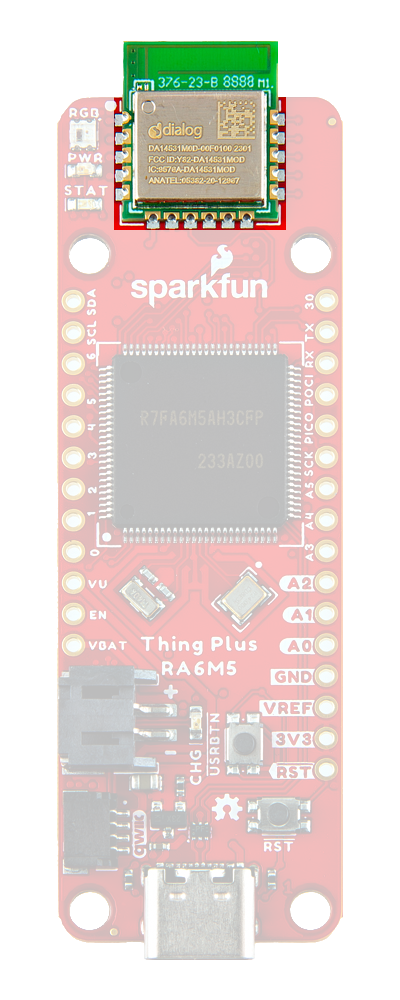{ width=200 }](./assets/img/hookup_guide/DA14531MOD.png "Click to enlarge")
<figcaption markdown>The DA14531MOD BLE module on the RA6M5 Thing Plus.</figcaption>
</figure>

</div>


<div markdown>

* Bluetooth 5.1 system-on-chip (SoC)
	* Supports up to three connections
	* 32-bit Arm® Cortex® M0+
		* Clock frequency: 16 MHz
		* Memory:
			* Flash: 128 Kb
			* RAM: 48 Kb
			* ROM: 144 Kb
			* OTP: 32 Kb
* Operating range (1.8 V - 3.6 V)
	* Receive: 2mA
	* Transmit: 4mA
	* Sleep: 1.8 &micro;A
* Radio
	* Transmit Power: -19 to +2.2 dBm
	* Receiver Sensitivity: -93 dBm


</div>

</div>


??? info "Debug Pins"
	The SWD pins for the DA14531MOD are available as 0.1" test points on the board. However, users are unlikely to utilize these pins unless they wish to modify the pre-existing firmware on the DA14531MOD.


	<div class="grid" markdown>

	<div markdown>

	<center>
		<table border="1" markdown>
			<tr markdown>
				<td style="text-align:center" markdown>**GND**</td>
				<td style="text-align:center" markdown>**SWCLK**</td>
				<td style="text-align:center" markdown>**3.3V**</td>
				<td style="text-align:center" markdown>**|**</td>
			</tr>
			<tr markdown>
				<td style="text-align:center" markdown>**RST**</td>
				<td></td>
				<td style="text-align:center" markdown>**SWDIO**</td>
				<td></td>
			</tr>
		</table>
	</center>


	!!! info
		In case users are interested, these are the pin connections of the SWD test points to the DA14531MOD. For more details, please reference the [schematic](./assets/board_files/schematic.pdf).

		- `SWDIO`: `P0_10`
		- `SWCLK`: `P0_2`

	!!! note
		In order to debug the DA14531MOD, users will need a debug probe. We recommend the [J-Link debug probes from Segger](https://www.segger.com/products/debug-probes/j-link/). However, users should verify the supported devices before purchasing these products; for example, we had a few issues with the [J-Link EDU Mini](https://www.sparkfun.com/products/24078).

	</div>


	<div markdown>

	<figure markdown>
	[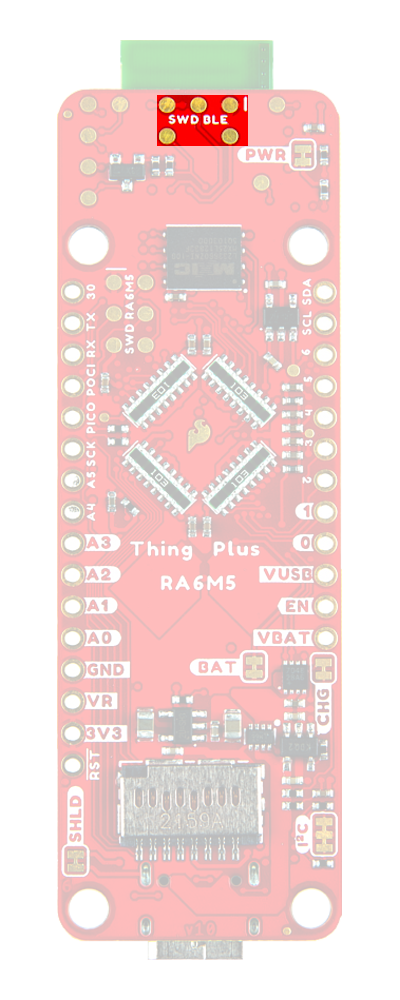{ width=200 }](./assets/img/hookup_guide/debug-DA14531.png "Click to enlarge")
	<figcaption markdown>The SWD pins for the DA14531MOD on the RA6M5 Thing Plus.</figcaption>
	</figure>

	</div>

	</div>


??? code "CodeLess Firmware"
	The [CodeLess™ AT command](https://lpccs-docs.renesas.com/UM-140-DA145x-CodeLess/index.html) allows users to easily configure the RA6M5 Thing Plus as a central or peripheral Bluetooth device. In addition, users can also potentially implement OTA updates with the CodeLess™ AT commands.

	The precompiled binary from the CodeLess SDK utilized as the firmware image, on the DA14531MOD of the RA6M5 Thing Plus, is the `codeless_531_datapump.hex` *(CodeLess for DA1453x datapump)*.


	!!! info "Serial Port Setting"
		The default settings of the serial port on the DA14531MOD, for AT commands:

		- BaudRate : 57600
		- DataBits : 8
		- StopBits : 1
		- Parity : None
		- Flow Control : None
		- Transmit Text: Append CR


*For more details, please refer to the [DA14531 datasheet](https://www.renesas.com/us/en/document/dst/da14531-module-datasheet), and [CodeLess user manual](ttps://lpccs-docs.renesas.com/UM-140-DA145x-CodeLess/index.html).*


## External Memory

### QSPI Flash
The RA6M5 Thing Plus features 16MB of QSPI Flash memory, with the MX25L12833F from [Macronix](https://www.macronix.com/en-us/Pages/default.aspx). The [MX25L12833F QSPI Flash memory](./assets/component_documentation/MX25L12833F.pdf) provides users with high-speed non-volatile memory to develop and execute data-driven applications. This feature is perfect for data logging, data processing, or executing memory-intensive algorithms. The QSPI Flash memory can also be used to store a firmware backup or enable software updates.


<div class="grid" markdown>

<div markdown>

The Flash memory is connected to the following GPIO:

- **CLK:** GPIO `P100` *(`D40`)*
- **D0:** GPIO `P102` *(`D42`)*
- **D1:** GPIO `P101` *(`D43`)*
- **D2:** GPIO `P104` *(`D44`)*
- **D3:** GPIO `P103` *(`D45`)*
- **SS:** GPIO `P501` *(`D41`)*

</div>


<div markdown>

<figure markdown>
[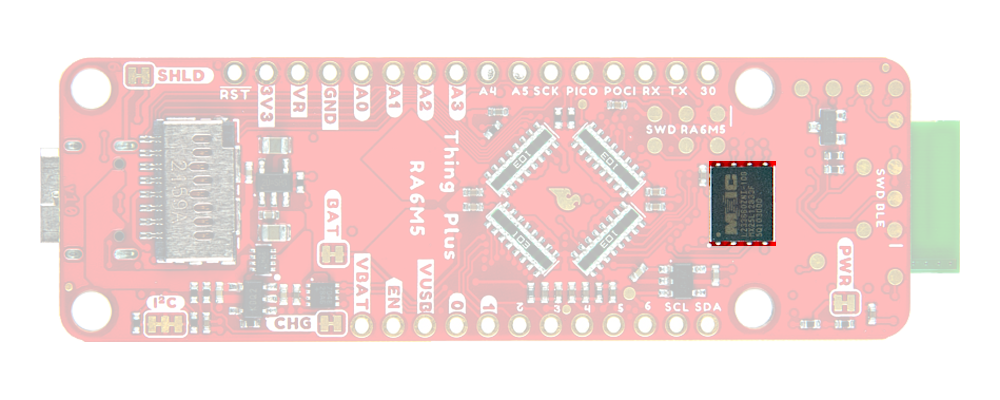{ width=500 }](./assets/img/hookup_guide/flash.png "Click to enlarge")
<figcaption markdown>The MX25L12833F QSPI Flash memory IC on the back of the RA6M5 Thing Plus.</figcaption>
</figure>

</div>

</div>


*For more details, please refer to the [MX25L12833F datasheet](./assets/component_documentation/MX25L12833F.pdf), the [schematic](./assets/board_files/schematic.pdf), [RA6M5 datasheet](https://www.renesas.com/us/en/document/dst/ra6m5-group-datasheet?r=1493931), and [RA6M5 user manual](https://www.renesas.com/us/en/document/man/ra6m5-group-users-manual-hardware?r=1493931).*


### &micro;SD Card Socket
The &micro;SD card socket is connected to the SD host interface for fast data logging. This feature is useful for data collection over extended periods and for simplifying data retrieval.


<div class="grid" markdown>

<div markdown>

The &micro;SD card slot is connected to the following GPIO:

- **CLK:** GPIO `P214` *(`D22`)*
- **D0:** GPIO `P208` *(`D24`)*
- **D1:** GPIO `P410` *(`D25`)*
- **D2:** GPIO `P206` *(`D26`)*
- **D3:** GPIO `P205` *(`D27`)*

</div>


<div markdown>

<figure markdown>
[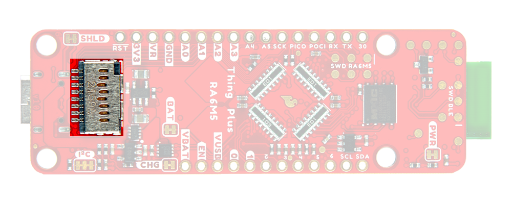{ width=400 }](./assets/img/hookup_guide/sd_card.png "Click to enlarge")
<figcaption markdown>&micro;SD card slot on the back of the RA6M5 Thing Plus.</figcaption>
</figure>

</div>

</div>


!!! warning "Data Corruption"
	To avoid corrupting an SD card, users should disable all activity with the SD card before removing it from the RA6M5 Thing Plus.

	The [FATFileSystem library](https://github.com/arduino/ArduinoCore-renesas/tree/main/libraries/FATFilesystem) built into the Renesas-Arduino core, supports &micro;SD cards with a **FAT32** file system *(i.e. SD cards **up to 32GB** in size)*.

	- While users may be able to use cards with a higher storage capacity, we highly advise against it. As users may experience data loss due to a corrupt file system *(i.e. SD cards with a storage capacity greater than 32GB are not meant to be formatted with a FAT32 file system)*.


!!! note
	The RA6M5 Thing Plus, offers users additional control of the SD card slot with the following pin connections:

	<center>

	| Pin Name | Connection to RA6M5   | Operation | Function |
	| :------: | :-------------------: | :-------: | :------- |
	| **SDEN** | GPIO `P708` *(`D35`)* | Active **LOW** | Controls power to the SD card slot.<br>- A **LOW** signal will disable power to the SD card slot |
	| **CD**   | GPIO `P210` *(`D28`)* | Active **LOW** | Read the pin latch, to determine if an SD card is inserted<br>- A **LOW** signal will indicate an SD card is present |
	| **WP**   | GPIO `P414` *(`D29`)* | Active **LOW** | Read if the write protection is engaged on the SD card<br>- A **LOW** signal will indicate write protection is enabled on the SD card |

	</center>


*For more details, please refer to the [schematic](./assets/board_files/schematic.pdf), [RA6M5 datasheet](https://www.renesas.com/us/en/document/dst/ra6m5-group-datasheet?r=1493931), and [RA6M5 user manual](https://www.renesas.com/us/en/document/man/ra6m5-group-users-manual-hardware?r=1493931).*


## I<sup>2</sup>C Bus

### Qwiic Connector
A Qwiic connector is provided for users to seamlessly integrate with [SparkFun's Qwiic Ecosystem](https://www.sparkfun.com/qwiic). Otherwise, users can also access the [I^2^C bus](#i2c-pins) through the PTH pins broken out on the board.


<figure markdown>
[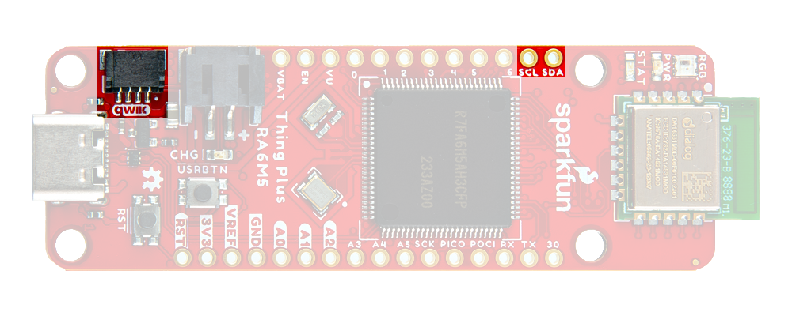{ width=750 }](./assets/img/hookup_guide/I2C.png "Click to enlarge")
<figcaption markdown>Qwiic connector and I^2^C pins on the RA6M5 Thing Plus.</figcaption>
</figure>


??? tip "What is Qwiic?"

	<div class="grid" markdown>

	<div markdown>

	<!-- Qwiic Banner -->
	<center>
	[{ width=400 }](https://www.sparkfun.com/qwiic)
	[{ width=400 }](https://www.sparkfun.com/qwiic)
	</center>

	---

	The [Qwiic connect system](https://www.sparkfun.com/qwiic) is a solderless, polarized connection system that allows users to seamlessly daisy chain I^2^C boards together. Play the video, to learn more about the Qwiic connect system or click on the banner above to learn more about [Qwiic products](https://www.sparkfun.com/qwiic).

	</div>


	<div style="max-height=400px;" markdown>

	<center>
	<div class="video-container">
	<iframe src="https://www.youtube.com/embed/x0RDEHqFIF8" title="SparkFun's Qwiic Connect System" frameborder="0" allow="accelerometer; encrypted-media; gyroscope; picture-in-picture" allowfullscreen></iframe>

	{ .qr width=100 }
	</div>
	</center>

	</div>

	</div>


	!!! info "Features of the Qwiic System"

		=== "No Soldering"

			{ align="left" width="90" }
			{ align="left" width="90" }

			Qwiic cables (4-pin JST) plug easily from development boards to sensors, shields, accessory boards and more, making easy work of setting up a new prototype.

		=== "Polarized Connector"

			{ align="left" width="90" }
			{ align="left" width="90" }

			There's no need to worry about accidentally swapping the `SDA` and `SCL` wires on your breadboard. The Qwiic connector is polarized so you know you’ll have it wired correctly every time.

			The part numbers for the PCB connector is `SM04B-SRSS` ([Datasheet](https://cdn.sparkfun.com/assets/parts/1/2/2/8/9/Qwiic_Connector_Datasheet.pdf)) and the mating connector on the cables is `SHR04V-S-B`; or an equivalent *1mm pitch, 4-pin JST connection*.

		=== "Daisy Chain-able"

			{ align="left" width="90" }
			{ align="left" width="90" }

			It’s time to leverage the power of the I^2^C bus! Most Qwiic boards will have two or more connectors on them, allowing multiple devices to be connected.


### Battery Fuel Gauge
The [MAX17048 fuel gauge](./assets/component_documentation/MAX17048.pdf), from [Analog Devices](https://www.analog.com/), measures the approximate charge/discharge rate, state of charge (SOC) (based on *ModelGauge* algorithm), and voltage of a connected battery. The sensor is also powered directly from a connected LiPo battery *(`VBAT`)*.


<div class="grid" markdown>

<div markdown>

<center>

| I^2^C Address | **0x36** (7-bit)<br>**0x6C** (write)/**0x6D** (read) |
| :-- | :-- |
| Voltage Measurement | Range: 2.5 - 5 V<br>Precision: &PlusMinus;7.5 mV/Cell<br>Resolution 1.25 mV/Cell
| Current Consumption | Sleep: .5 - 2 µA<br>Hibernate: 3 - 5 µA<br>Active: 23 - 40 µA |

</center>

!!! info "Alert Pin"
	The fuel gauge features an `Alert` pin, which can be configured to trigger an interrupt *(active **LOW**)* on GPIO `P000` *(`D39`)* of the RA6M5 for:

	- Low Charge
	- 1% Charge *(Remaining)*
	- IC Reset
	- Overvoltage
	- Undervoltage

</div>


<div markdown>

<figure markdown>
[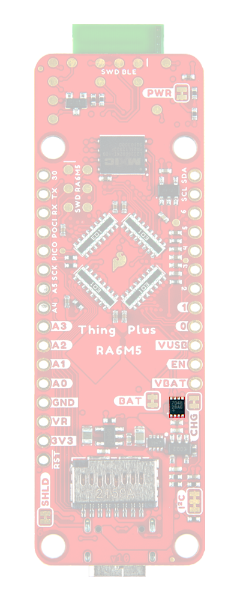{ width=200 }](./assets/img/hookup_guide/MAX17048.png "Click to enlarge")
<figcaption markdown>The MAX17048 fuel gauge on the RA6M5 Thing Plus.</figcaption>
</figure>

</div>

</div>


*For more information, please refer to the [MAX17048 datasheet](./assets/component_documentation/MAX17048.pdf) and the [schematic](./assets/board_files/schematic.pdf).*


## Status LEDs
There are four status LEDs on the RA6M5 Thing Plus:


<div class="grid" markdown>

<div markdown>

- `PWR` - Power *(Red)*
	- Illuminates once power is applied to `3V3`
- `RGB` - WS2812 *(RGB)*
	- An addressable [WS2812 LED](./assets/component_documentation/WS2812C-2020.pdf)
	- Connected to GPIO `P105` *(`D13` or `RGB_LED`)* of the RA6M5
- `STAT` - Status *(Blue)*
	- Connected to the RA6M5 `P106` *(`D14`/`LED_BUILTIN`)* GPIO
- `CHG` - Battery Charge *(Yellow)*
	- **ON** - Actively charging a battery
	- **OFF** - The charge controller is shut down or battery charging is complete

</div>


<div markdown>

<figure markdown>
[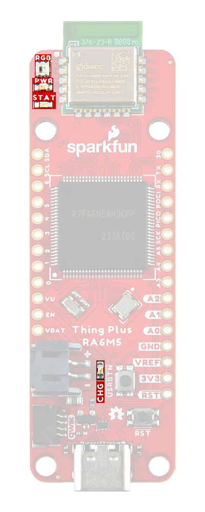{ width=200 }](./assets/img/hookup_guide/LEDs.png "Click to enlarge")
<figcaption markdown>
The status indicator LEDs on the RA6M5 Thing Plus.
</figcaption>
</figure>

</div>

</div>


## Buttons
There are two buttons on the RA6M5 Thing Plus: ++"RST"++ and ++"USRBTN"++


<figure markdown>
[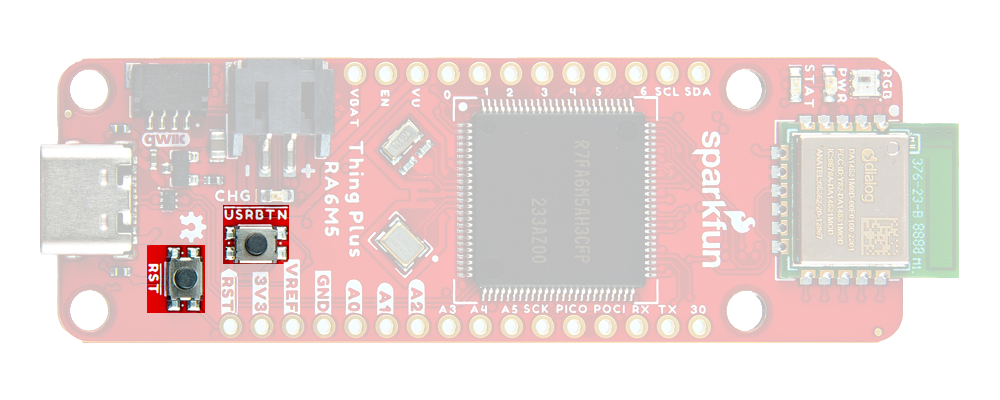{ width=700 }](./assets/img/hookup_guide/Buttons.png "Click to enlarge")
<figcaption markdown>Buttons on the RA6M5 Thing Plus.</figcaption>
</figure>


- ++"USRBTN"++ - The **user** button is provided as an available input for the RA6M5; it is connected to GPIO `P415` *(`D31`)*
- ++"RST"++ - The **reset** button allows users to reset the firmware running on the RA6M5 without interrupting the power
	<!-- - DFU Mode - The RA6M5 can be manually forced into DFU mode to upload code
		1. Double-tap the ++"RST"++ button
			- The `STAT` LED should be fading in/out very slowly
		1. Users should now, be able to upload a new program
			- It shouldn't be necessary to select a COM port in the Arduino IDE; only the board needs to be selected
		1. Once programming is complete, the MCU should reboot on its own. Otherwise:
			- Press the ++"RST"++ button
			- Power cycle the board -->


??? success "DFU Mode"
	If users are having issues uploading code to the board, the RA6M5 can be manually forced into DFU mode. This issue, often occurs when the USB connection is busy and a reset can't be triggered on the RA6M5, to initialize the upload process. To force the RA6M5 Thing Plus into DFU mode:

	1. Double-tap the ++"RST"++ button
		- The `STAT` LED should be fading in/out very slowly
	1. Users should now, be able to upload a new program
		- It shouldn't be necessary to select a COM port in the Arduino IDE; only the board needs to be selected
	1. Once programming is complete, the MCU should reboot on its own. Otherwise:
		- Press the ++"RST"++ button
		- Power cycle the board


*For more details, please refer to the [schematic](./assets/board_files/schematic.pdf).*


## Jumpers

??? note "Never modified a jumper before?"
	Check out our [Jumper Pads and PCB Traces tutorial](https://learn.sparkfun.com/tutorials/664) for a quick introduction!

	<div class="grid cards col-4" markdown align="center">

	-   <a href="https://learn.sparkfun.com/tutorials/664">
		<figure markdown>
		
		</figure>

		---

		**How to Work with Jumper Pads and PCB Traces**</a>

	</div>


The five jumpers on the back of the board can be used to easily modify the hardware connections on the board.


<div class="grid" markdown>

<div markdown>

<figure markdown>
[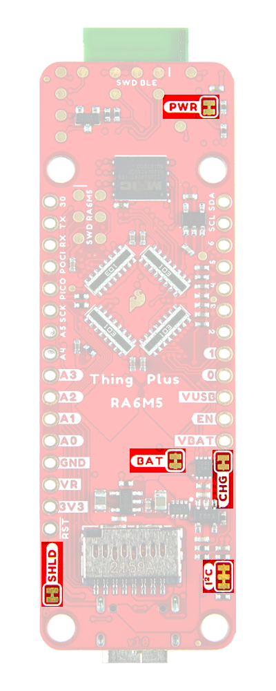{ width=200 }](./assets/img/hookup_guide/jumpers.png "Click to enlarge")
<figcaption markdown>The jumpers on the back of the RA6M5 Thing Plus PCB.</figcaption>
</figure>

</div>


<div markdown>

- **`PWR`** - Cut this jumper to disable the red, `PWR` LED
- **`RST`** - Cut this jumper to disconnect the reset pin of the DA14531MOD from the RA6M5 `P115`/`D37` GPIO
- **`SHLD`** - Cut this jumper to isolate the USB-C connector shield from GND
- **`I2C`** - Open this dual-jumper to disconnect the pull-up resistors from the `SDA` and `SCL`
- **`CHG`** - Cut this jumper to disable the yellow, `CHG` LED

</div>

</div>


*For more details, please refer to the [schematic](./assets/board_files/schematic.pdf).*
