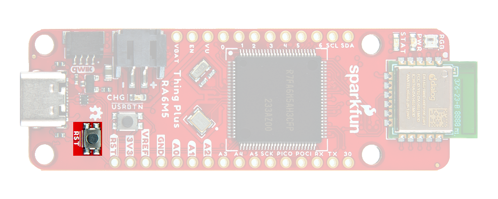

!!! warning "Need Help?"
	If you need technical assistance or more information on a product that is not working as you expected, we recommend heading over to the [SparkFun Technical Assistance](https://www.sparkfun.com/technical_assistance) page for some initial troubleshooting.

	

	[SparkFun Technical Assistance Page](https://www.sparkfun.com/technical_assistance){ .md-button .md-button--primary }
	

	If you can't find what you need there, the [SparkFun GNSS Forum](https://forum.sparkfun.com/viewforum.php?f=116) is a great place to ask questions.

	!!! info "Account Registration Required"
		If this is your first visit to our forum, you'll need to create a [Forum Account](https://forum.sparkfun.com/ucp.php?mode=register) to post questions.

## Upload Issues
If users have issues during the uploading process, they can try to manually force the board into DFU mode with the reset button. Double-tapping the ++"RST"++ button will force the MCU to into the Device Firmware Update mode. The board will remain in this mode, until it power cycles *(which happens automatically, after uploading new firmware)* or the reset button is pressed.

1. Double-tap the ++"RST"++ button
	- The `STAT` LED should be fading in/out very slowly
1. Users should now, be able to upload a new program
	- It shouldn't be necessary to select a COM port in the Arduino IDE; only the board needs to be selected
1. Once programming is complete, the MCU should reboot on its own. Otherwise:
	- Press the ++"RST"++ button
	- Power cycle the board

<figure markdown>
[{ width=700 }](./assets/img/hookup_guide/Button-rst.png "Click to enlarge")
<figcaption markdown>++"RST"++ button on the RA6M5 Thing Plus.</figcaption>
</figure>

## Digital I/O

### Utilizing Interrupts
When utilizing an interrupt on a digital GPIO, the attached interrupt service routine should be able to execute within the shortest, possible time frame. Otherwise, the suspended task could trigger various faults or errors.

## &micro;SD Card

### Compatibility
The [FATFileSystem library](https://github.com/arduino/ArduinoCore-renesas/tree/main/libraries/FATFilesystem) built into the Renesas-Arduino core, supports &micro;SD cards with a **FAT32** file system *(i.e. SD cards **up to 32GB** in size)*.

- While users may be able to use cards with a higher storage capacity, we highly advise against it. As users may experience data loss due to a corrupt file system *(i.e. SD cards with a storage capacity greater than 32GB are not meant to be formatted with a FAT32 file system)*.

### Hot Swapping
To avoid corrupting an SD card, users should disable all activity with the SD card and disconnect power before removing it from the RA6M5 Thing Plus.

